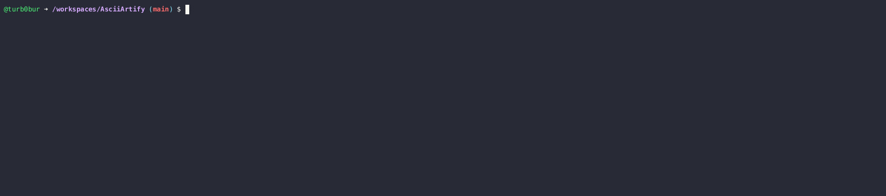

## ArgoCD GUI access
<a target="_blank" href="demo_argocd_access_3x.gif">   
     
</a>

### Commands used during the demo

#### Create argo cluster via **k3d**
```bash
k3d cluster create argo
kubectl cluster-info
```

#### Install [ArgoCD](https://argo-cd.readthedocs.io/en/stable/getting_started/)
```bash
kubectl create namespace argocd
kubectl apply -n argocd -f https://raw.githubusercontent.com/argoproj/argo-cd/stable/manifests/install.yaml
```

#### Port Forwarding
```bash
kubectl port-forward svc/argocd-server -n argocd 8082:443
```

#### Retrieve password to ArgoCD GUI
In another Bash terminal
```bash
kubectl -n argocd get secret argocd-initial-admin-secret -o jsonpath={.data.password} | base64 -d; echo
```

#### Clear all created resources
```bash
kubectl delete all --all -n argocd
kubectl delete ns argocd
k3d cluster delete argo
```
